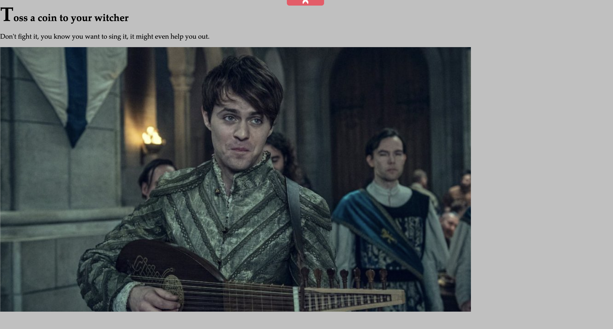
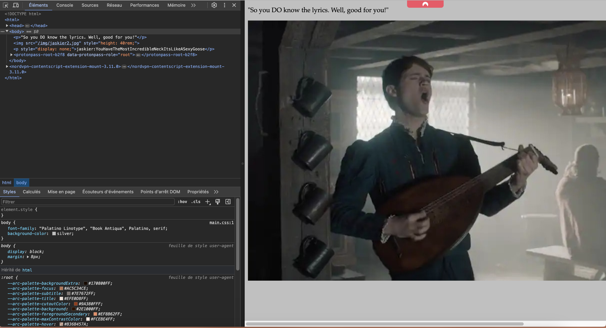

# CTF: Toss a Coin


## Description

> Sing with me this amazing song !

## Write-up

The flag is a reference to the song "Toss a Coin to Your Witcher" from the Netflix series "The Witcher".

UserFlag: `EPI{R3Sp3C7_D03sNT_M4k3_h1S70rY}`  
RootFlag: `?`


## Flag Solutions

### User Flag

First thing to do is to check open ports on the target machine. We can do this by running a port scan using `nmap`.

```bash
nmap -sSV $IP
```

Results : 
```bash
PORT   STATE SERVICE VERSION

22/tcp open  ssh     OpenSSH 7.6p1 Ubuntu 4ubuntu0.6 (Ubuntu Linux; protocol 2.0)

80/tcp open  http    Golang net/http server (Go-IPFS json-rpc or InfluxDB API)

MAC Address: 02:EC:2D:13:83:FB (Unknown)

Service Info: OS: Linux; CPE: cpe:/o:linux:linux_kernel
```

The target machine has two open ports, 22 and 80. Port 80 is running a web server. Let's visit the website.

```
http://$IP
```

We found a page 



We use gobuster to find hidden directories. 

```bash
gobuster dir --url http://$IP -w Tools/wordlists/dirbuster/directory-list-2.3-medium.txt
```

Results : 
```bash
===============================================================
Gobuster v3.0.1
by OJ Reeves (@TheColonial) & Christian Mehlmauer (@_FireFart_)
===============================================================
[+] Url:            http://10.10.93.57
[+] Threads:        10
[+] Wordlist:       Tools/wordlists/dirbuster/directory-list-2.3-medium.txt
[+] Status codes:   200,204,301,302,307,401,403
[+] User Agent:     gobuster/3.0.1
[+] Timeout:        10s
===============================================================
2024/05/16 08:49:09 Starting gobuster
===============================================================
/img (Status: 301)
/t (Status: 301)
Progress: 6045 / 220561 (2.74%)^C
[!] Keyboard interrupt detected, terminating.
===============================================================
2024/05/16 08:49:11 Finished
===============================================================
```

We found two directories `/img` and `/t`. Let's visit the `/t` directory.

http://$IP/t


We do the same thing with the `/t` directory.

```bash
gobuster dir --url http://$IP/t -w Tools/wordlists/dirbuster/directory-list-2.3-medium.txt
```

Results : 
```bash
===============================================================
Gobuster v3.0.1
by OJ Reeves (@TheColonial) & Christian Mehlmauer (@_FireFart_)
===============================================================
[+] Url:            http://10.10.93.57
[+] Threads:        10
[+] Wordlist:       Tools/wordlists/dirbuster/directory-list-2.3-medium.txt
[+] Status codes:   200,204,301,302,307,401,403
[+] User Agent:     gobuster/3.0.1
[+] Timeout:        10s
===============================================================
2024/05/16 08:49:09 Starting gobuster
===============================================================
/img (Status: 301)
/o (Status: 301)
Progress: 6045 / 220561 (2.74%)^C
[!] Keyboard interrupt detected, terminating.
===============================================================
2024/05/16 08:49:11 Finished
===============================================================
```

We do the same on the `/o`and after that we found a directory `/s` and after the `/s`again and we do the same to find at the end the `/y` directory.

Is the lyrics of the song.

The url is : 
```
http://$IP/t/o/s/s/_/a/_/c/o/i/n/_/t/o/_/y/o/u/r/_/w/i/t/c/h/e/r/_/o/h/_/v/a/l/l/e/y/_/o/f/_/p/l/e/n/t/y
```

We found the flag in the source code of the page.


We found a ssh login. 

```bash
ssh jaskier@$IP
Password: YouHaveTheMostIncredibleNeckItsLikeASexyGoose
```

We do a `ls` and we found a file `user.txt`.

```bash
cat user.txt
```

UserFlag: `EPI{R3Sp3C7_D03sNT_M4k3_h1S70rY}`

### Root Flag

```
### TO DO
```
